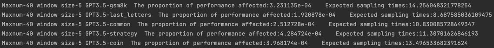

# Early-stopping Self-Consistency [ICLR 2024]

This is the repo for ICLR 2024 paper: Escape Sky-high Cost: Early-stopping Self-Consistency for Multi-step Reasoning.

Full descriptions about this repo will come soon.

## CONTROL SCHEME
#### step 1. Obtain the sampling result of the first window
For any dataset _D_, Change the _model_type_ in _consistency__{D}.py to a specific model, and change _sc_cum_ to the first sampling window size _w_. After running, you will get probs{w}.json under {model_type}_result/{D}/.
#### step 2. Obtain the expected sampling times and impact on performance under the specified sampling window size and maximum sampling times.
Set _sc_num_ as the sampling window size and _max_up_ as the maximum sampling times in _control_scheme.py_, and directly run it, you will get results like:
